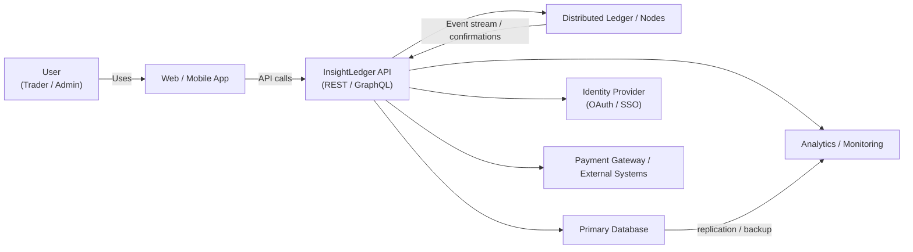
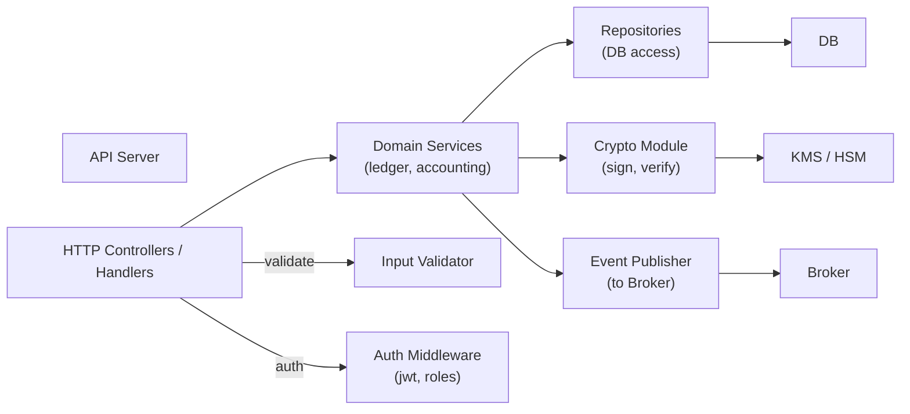
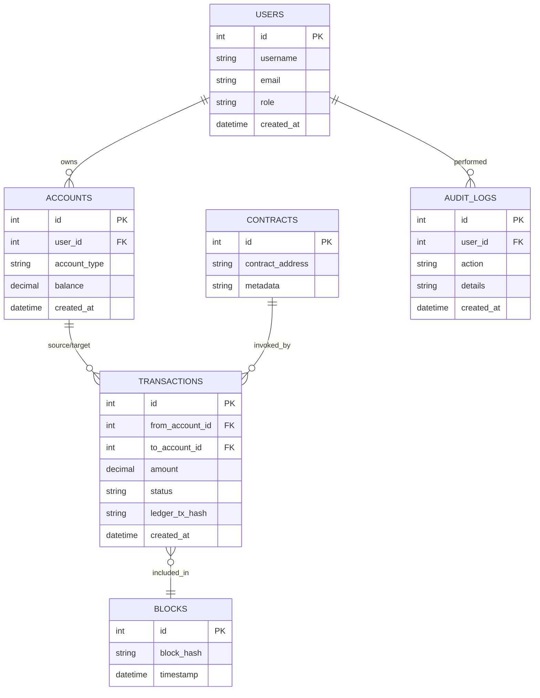
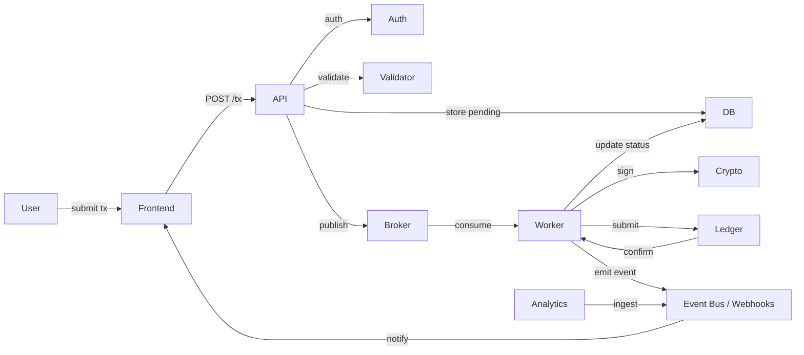
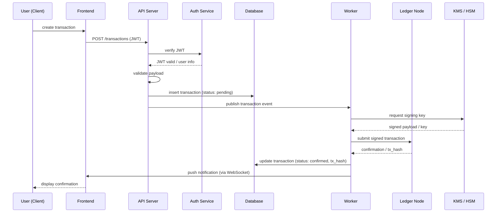
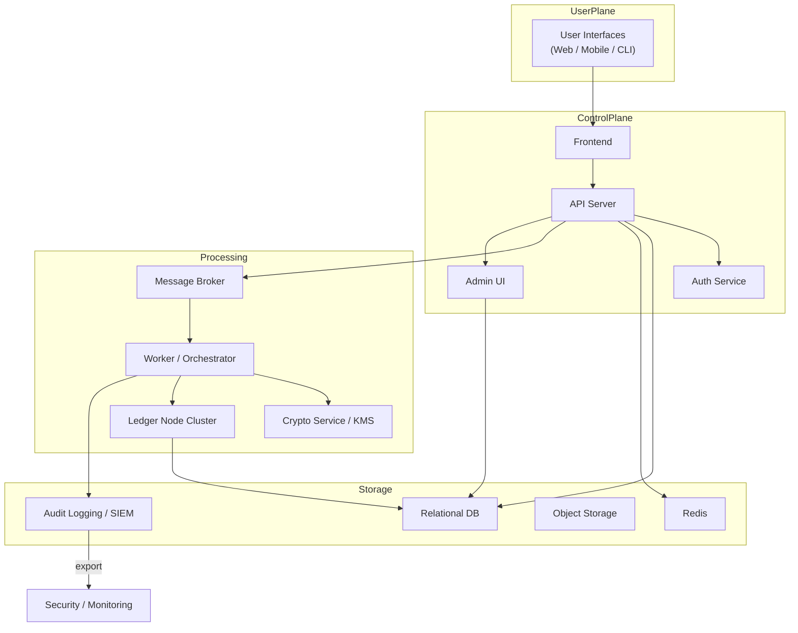
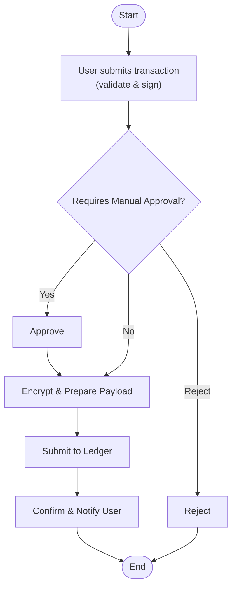
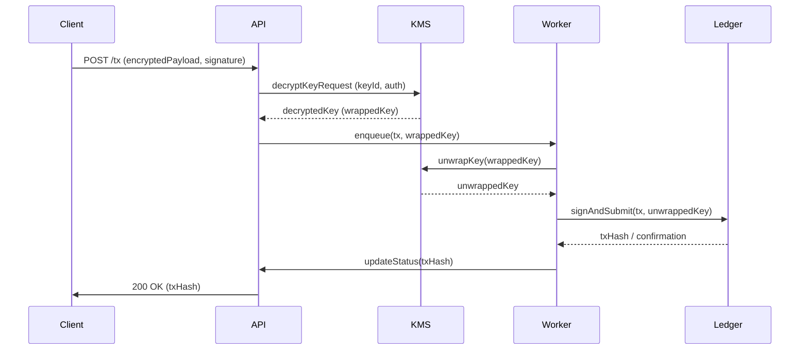
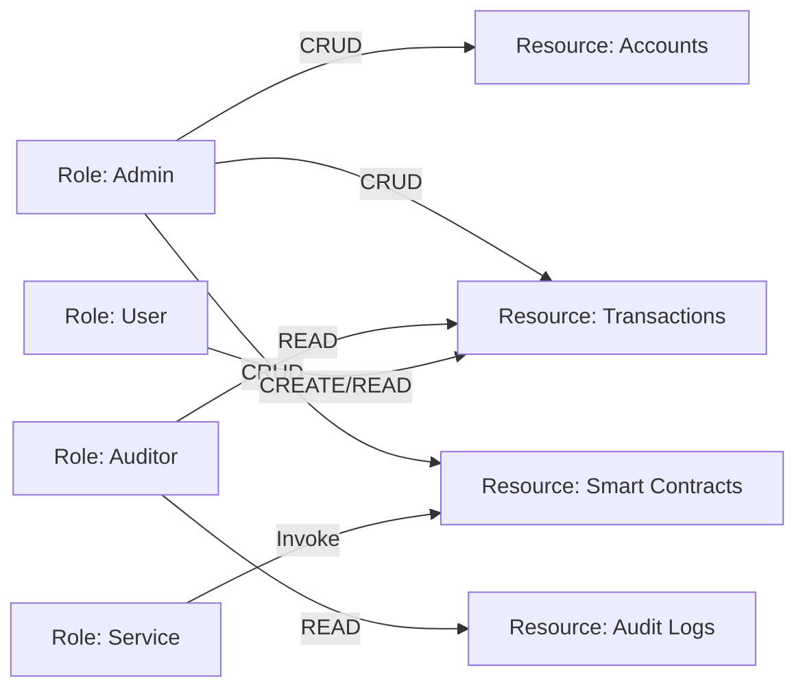
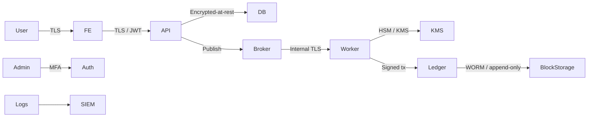

# InsightLedger — Architecture & Flow (Mermaid diagrams)

This file contains high-level architecture diagrams for the InsightLedger repository. Each diagram is written in Mermaid so you can render them in GitHub or any Mermaid-compatible renderer.

Notes:
- These are high-level, technology-agnostic diagrams intended to help engineers orient themselves before touching the codebase.
- Tweak component names and connections to match repository specifics (service names, ports, cloud provider, etc.).
- If you want me to convert any of these into PNG/SVG files, or to align them with specific folders/classes in the repo, tell me which files to map and I will generate a mapping and update diagrams.

---

## Architecture & Flow
C4 slices, ERDs, and runtime flows that help engineers orient themselves before touching the repo.

### C4 Level 1 — Context


---

### C4 Level 2 — Containers
```mermaid
flowchart LR
  subgraph Client
    FE[Frontend SPA\n(Web / Mobile)]
  end

  subgraph Backend
    API["API Server\n(Node / Java / Go)"]
    Worker["Worker / Batch Processor"]
    Auth["Auth Service\n(OIDC / JWT)"]
    Broker["Message Broker\n(Kafka / RabbitMQ)"]
    Crypto["Crypto Service\n(Signing, KMS)"]
  end

  subgraph Data
    DB["Relational DB\n(Postgres)"]
    Cache["Cache\n(Redis)"]
    LedgerNodes["Ledger Nodes\n(Private / Consortium)"]
    ObjectStorage["Object Storage\n(S3)"]
  end

  FE --> |HTTPS| API
  API --> Auth
  API --> DB
  API --> Cache
  API --> Broker
  API --> Crypto
  Worker --> Broker
  Worker --> LedgerNodes
  Worker --> DB
  LedgerNodes --> DB
  DB --> ObjectStorage
```

---

### C4 Level 3 — Components (Backend API)


---

### Database ERD


---

### Deployment topology — Infrastructure and deployment architecture
```mermaid
flowchart LR
  LB[Load Balancer\n(Cloud LB / ALB)]
  Ingress[Ingress Controller\n(K8s)]
  subgraph K8s["Kubernetes Cluster"]
    API_Pods["API Pods"]
    Worker_Pods["Worker Pods"]
    Auth_Pods["Auth / IAM"]
    Broker_Pods["Message Broker StatefulSet"]
  end
  DBCluster["Managed DB Cluster\n(Postgres HA)"]
  ObjectStore["S3 / Object Storage"]
  LedgerCluster["Ledger Node Cluster\n(consortium/private)"]
  KMS["KMS / HSM"]
  CI["CI/CD Pipeline\n(GitHub Actions / GitLab CI)"]

  LB --> Ingress
  Ingress --> API_Pods
  Ingress --> Auth_Pods
  API_Pods --> Broker_Pods
  API_Pods --> DBCluster
  Worker_Pods --> Broker_Pods
  Worker_Pods --> LedgerCluster
  Worker_Pods --> DBCluster
  LedgerCluster --> DBCluster
  API_Pods --> KMS
  CI -->|deploy| K8s
  CI -->|deploy| LedgerCluster
```

---

### Detailed data flow — Data flow through the system components


---

### Sequence of interactions — User transaction flow


---

### System Architecture — Complete system architecture diagram


---

## Security & Governance

### BPMN (user request -> approval -> commit to ledger)


---

### Encryption/decryption sequence — Detailed encryption and decryption flow


---

### Role-based access control (RBAC)


---

### Security-aware data flow (highlighting encryption, keys, and isolation)


---

### Threat model quickview
```mermaid
flowchart LR
  subgraph Assets
    A1[User Credentials]
    A2[Transaction Data]
    A3[Signing Keys]
    A4[Ledger Integrity]
  end

  subgraph Threats
    T1[Credential Theft\n(phishing)]
    T2[Data Tampering\n(at rest/in transit)]
    T3[Key Compromise\n(HSM bypass)]
    T4[Insider Abuse]
  end

  subgraph Mitigations
    M1[MFA / OIDC]
    M2[TLS + Encryption at rest]
    M3[HSM / KMS, key rotation]
    M4[Audit Logs, RBAC, Approval Workflows]
  end

  A1 --> T1
  A2 --> T2
  A3 --> T3
  A4 --> T2
  T1 --> M1
  T2 --> M2
  T3 --> M3
  T4 --> M4
```

---
